# UAS BAHASA PEMROGRAMAN SMT 1
## Nama  : FAQIH IRIANTO
## NIM   : 312210021
## Kelas : TI 22 C1
- **Link Youtube  : https://youtu.be/caUdWrZrY7c**
- Tutorial pdf  : [Tutorial pdf](screenshot/tutorial.pdf)
# Struktur Package dan Modul Program
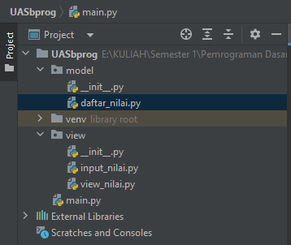

# Penjelasan Program
## Modul Model
### daftar_nilai
- Tambah data
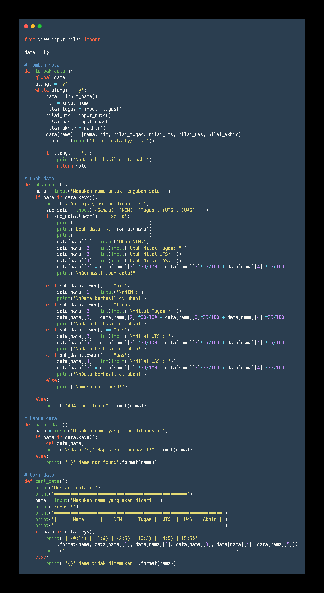
- Penjelasan
1. view.input_nilai import = digunakan untuk mengimport data dari modul view > (file) input_nilai.py sebagai tampilan hasil perhitungan nilai.
2. data {} = digunakan untuk menampung list yang akan digunakan pada tampilan hasil.
3. def tambah_data() : = deklarasi fungsi untuk menyatukan perintah agar nanti dapat dipanggil dan digunakan berkali-kali.
4. Menggunakan looping while true agar dapat dijalankan berulang kali.
5. Didalamnya terdapat beberapa fungsi dari file input_nilai dimana disini akan kita gunakan untuk menambah data dan terdapat fungsi untuk memproses nilai yang akan ditampilkan.
6. ulangi = (input('Tambah data?(y/t) : ')) = digunakan untuk menambahkan data yang lain.
7. return data untuk mengembalikan ke tampilan awal.
- Mengubah data
1. Deklarasikan fungsi ubah_data agar dapat digunakan berkali-kali
2. Input nama yang akan diganti mengunakan =  nama = input("Masukan nama untuk mengubah data: ")
3. Jika nama yang diinput ada dalam data > if nama in data.keys(): ada maka akan diproses di sub data > sub_data = input("(Semua), (NIM), (Tugas), (UTS), (UAS) : ") = dimana disini kita dapat memilih data apa yang akan diubah.
4. Saya menggunakan percabangan else if untuk mengeksekusi perintah yang diminta oleh user yang akan mengakses, dimana kita dapat mengubah semua data atau hanya beberapa data saja.
5. Saya menggunakan lowercase sebagai input perintah agar lebih mudah.
6. data[nama][5] = data[nama][2] *30/100 + data[nama][3]*35/100 + data[nama][4] *35/100 = Didalamnya kita input format nilai yang kita inginkan untuk memproses nilai akhir.
7. Apabila perintah yang akan diinput user tidak ada maka kita gunakan percabangan else
- Menghapus data
1. Deklarasikan fungsi hapus data = def hapus_data():
2. Input nama yang akan dihapus dengan memanggil variabel nama = input("Masukan nama yang akan dihapus : ")
3. Saya menggunakan percabangan if else dimana apabila nama yang di input ada pada data (data.keys()) maka akan dihapus menggunakan code 'del'
- Mencari data 
1. Deklarasikan fungsi cari data = def cari_data():
2. Menggunakan code input agar user dapat leluasa mengetik perintah data yang akan dicari.
3. Saya menggunakan perulangan if else dengan menyertakan list data dimana apabila user menginput nama yang akan dicari akan terlihat dengan mudah apabila kita menggunakan list.
4. else print("'{}' Nama tidak ditemukan!".format(nama)) = apabila nama yang diinput tidak ada maka else akan mencetak nama tidak ditemukan.(nama yang diinput). 

## Modul view
- input__nilai.py
    * didalamn file ini terdapat beberapa deklarasi fungsi input seperti Nama, NIM, nilai tugas, nilai UTS, nilai UAS dan format perhitungan nilai akhir sesuai keinginan ( nilai_akhir = (nilai_tugas)*30/100 + (nilai_uts)*35/100 + (nilai_uas)*35/100)

- view_nilai.py
    * didalam file ini terdapat deklarasi fungsi dari tampilan yang sudah dibuat dan menggunakan list dan terdapat kondisi percabangan if else.

## Code file main.py
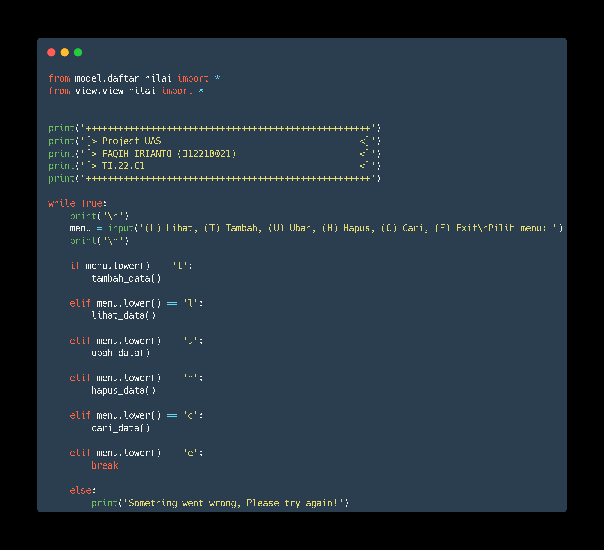

## Output Program
- Tampilan awal
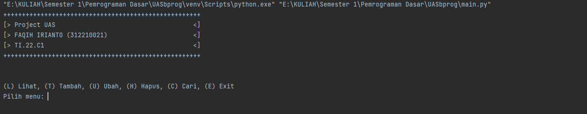
- Tambah data
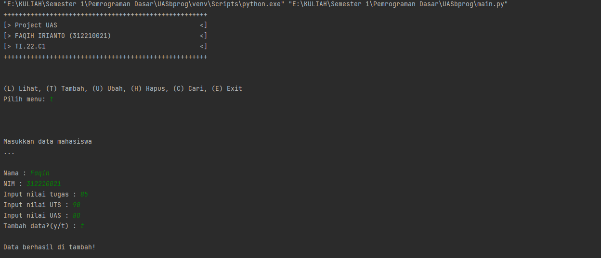
- Lihat data
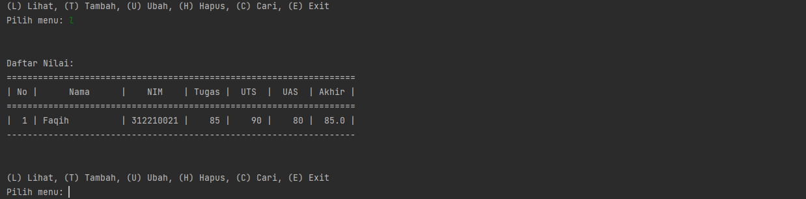
- Menambah data lain
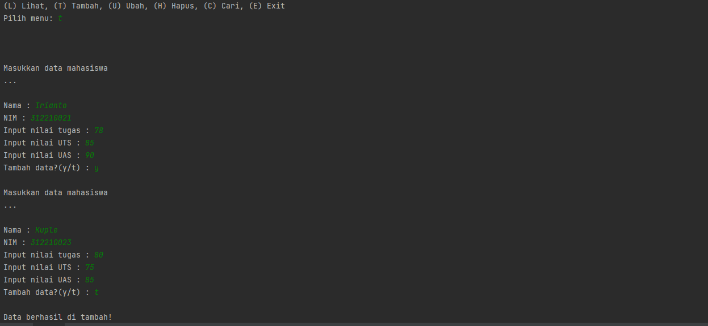
- Melihat data tambahan
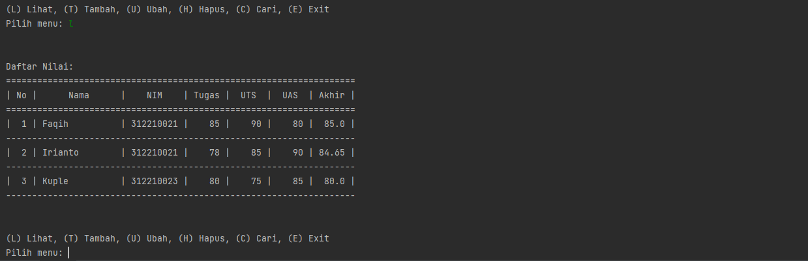
- Ubah data
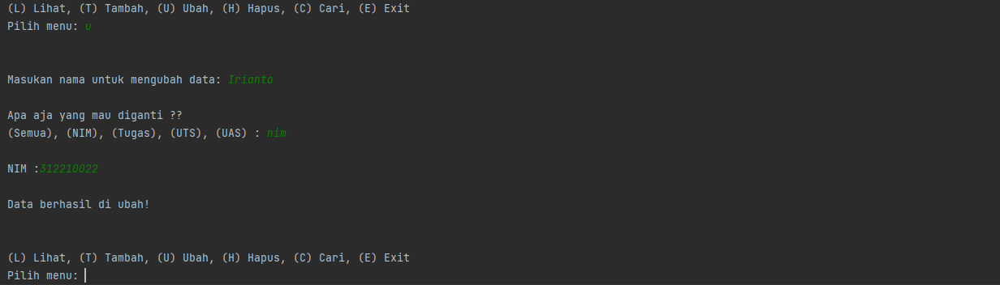
- Hasil ubah data

- Mencari data
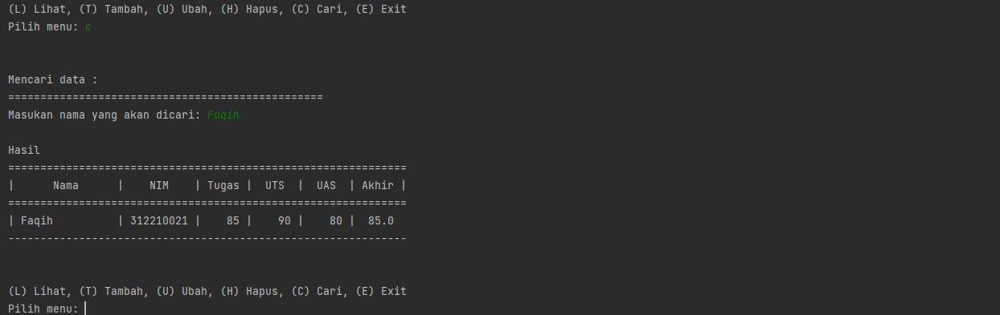
- Hapus data
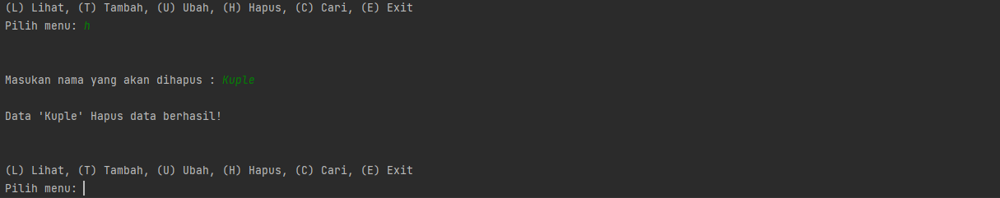
- Setelah data dihapus
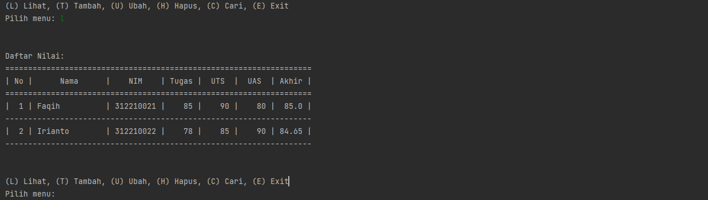

## Demikian Program yang saya buat
# Terima Kasih!